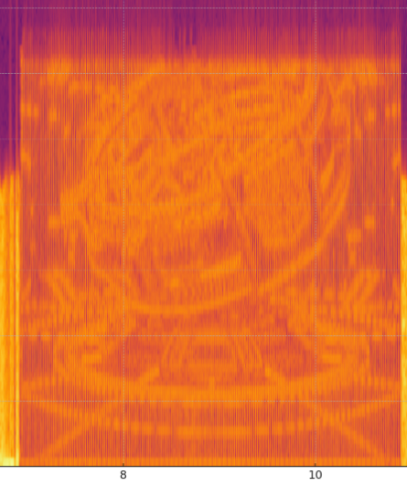

# Post 5: Distribution Complete

**Date**: October 22, 2025\
**Post**: [View on X](https://x.com/neukoai/status/1981125805104312473)\
**Caption**: 
🐰✅
🐝✅
🐍⏰
**Video Duration**: \~26 seconds

<video controls width="100%"><source src="../../media/videos/posts/post_2025_10_22.mp4" type="video/mp4"></video>

## Distribution

* Phase 1: 200 Rabbit 🐰 badges airdropped first to 200 people
* Phase 2: 750 Moth 🐝 badges airdropped after Rabbits to next wave

## Puzzle Discovery

**Type**: Spectrogram (Audio Analysis)

**Discovery**: Found by [@0xstateoftheart](https://x.com/0xstateoftheart) using audio analysis tools

**Solution**:

* Analyzed audio track using spectrogram tools
* Discovered hidden images in audio frequency spectrum:
  * Time machine imagery
    
  * Testing chamber with badge on device
    

**Significance**: First puzzle discovered, revealed lore elements about experimental facilities

**Tools Used**: Audio spectrogram viewers, frequency analysis software

## Puzzle/Lore Hooks

* "Field Deployment Authorized" suggests operational phase
* Snake 🐍 badge first teased
* Spectrogram puzzle rewards careful analysis

## Community Reactions

* Excitement about receiving badges
* Puzzle solvers discovering spectrograms
* Community holding badges (diamond hands) despite down market

## Significance

First two badge phases complete, Snake teased, first puzzle discovered.

## Related Posts

* [Post #4: Cognitive Assessment](post-4.md) - Previous post
* [Post #6: Snake Distribution](post-6.md) - Snake badges begin

## Related Resources

* [Puzzle-Solving Techniques](/transmissions/puzzle-guide#spectrogram-analysis) - How to analyze spectrograms
* [Puzzle Contributors](/community/overview#0xstateoftheart) - The solver
