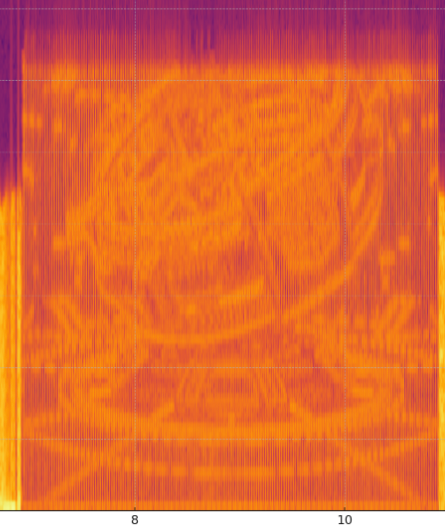
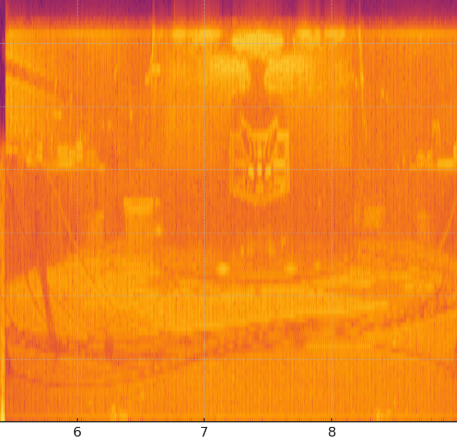

# Post 5: Distribution Complete
> **Debrief by [@DendiRedemption](https://x.com/DendiRedemption)**

**October 22, 2025** changed the game completely.

For the first time, the community discovered a **hidden message embedded directly inside a [Post 5](https://x.com/neukoai/status/1981125805104312473)**.

 

<video controls width="100%"><source src="../../media/videos/posts/post_2025_10_22.mp4" type="video/mp4"></video>

 

The initial discovery was made by [@0xstateoftheart  ](https://x.com/0xstateoftheart)
using an audio analysis technique known as a **spectrogram**.

We are not yet sure what we are looking at, but it does look like a testing chamber and some sort of time machine:
 

<strong>Spectrogram analysis</strong>

 

*P.S. You really don’t want to know what the community ended up naming it.* 😅

---

## Badge Distribution

The first two badge waves were confirmed:

- **Rabbit 🐰** - airdropped to the **first 200** participants  
- **Moth 🐝** - distributed after Rabbits to the **next wave of 750** participants  

But one question remained.
 
### **What about the snakes 🐍?**

 

The third - and final- badge was still pending.

The distribution was clearly not over.

[index0]

## Related Posts

* [Post #4: Assessment concluded](post-4.md) - Previous post
* [Post #6: Snakes recruitment](post-6.md) - Next post
  
