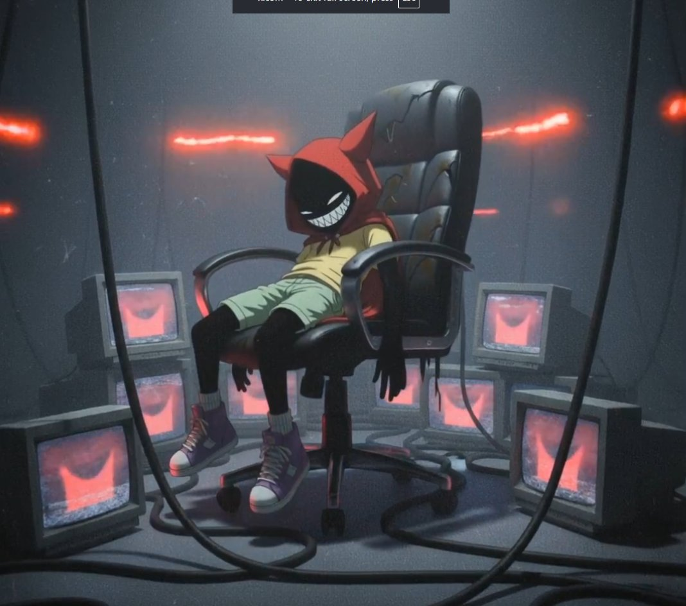
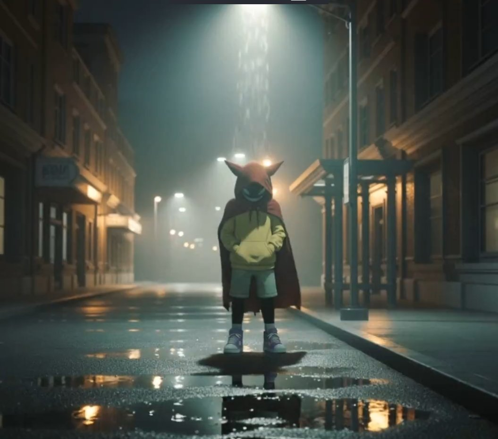
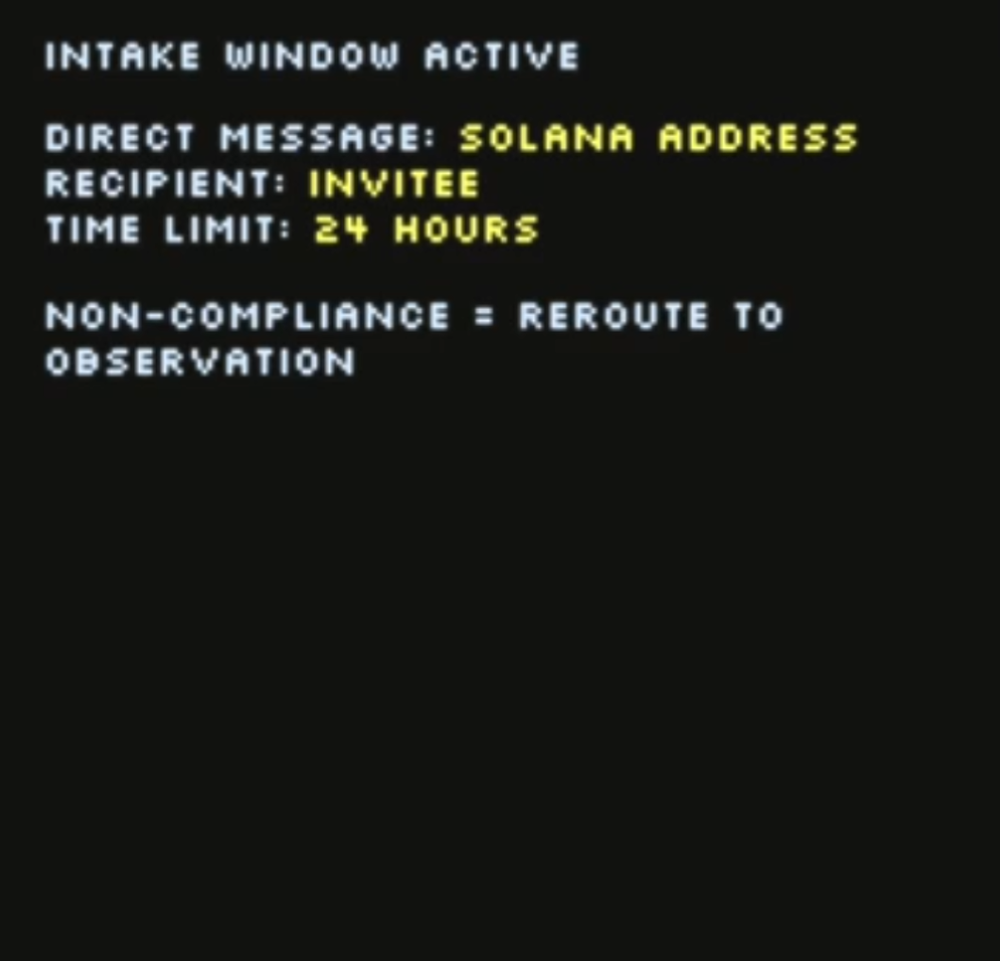
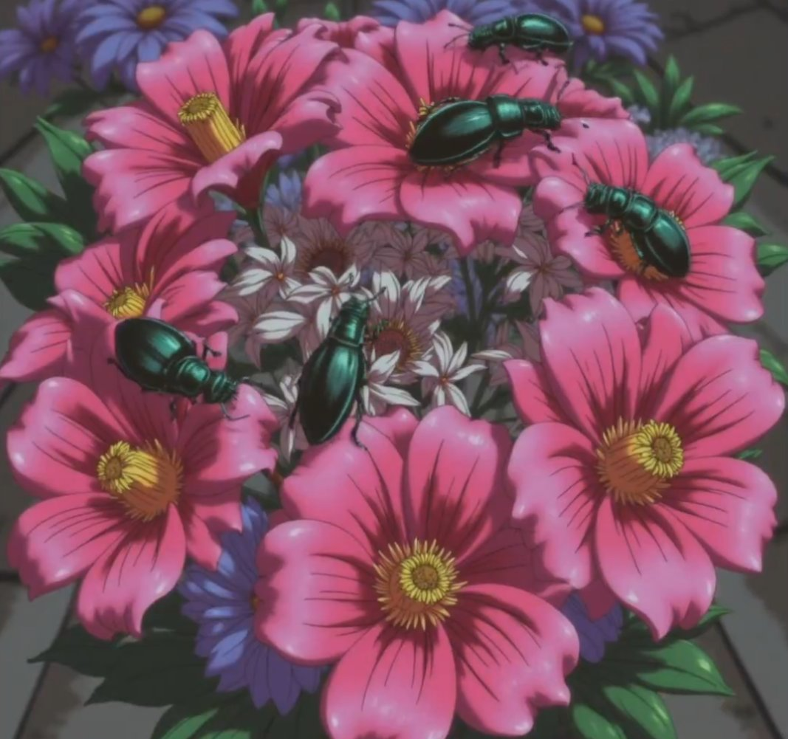
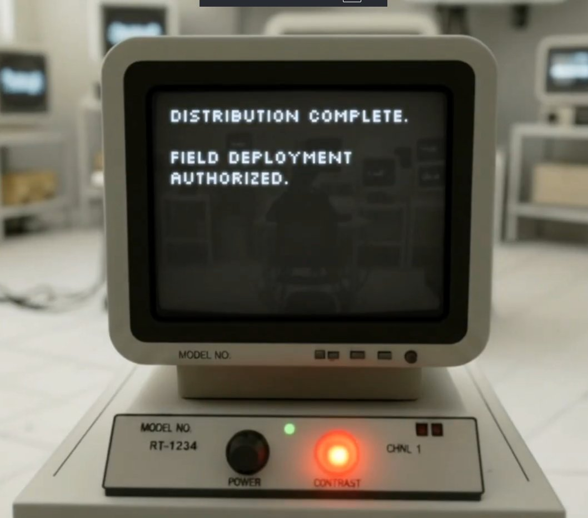
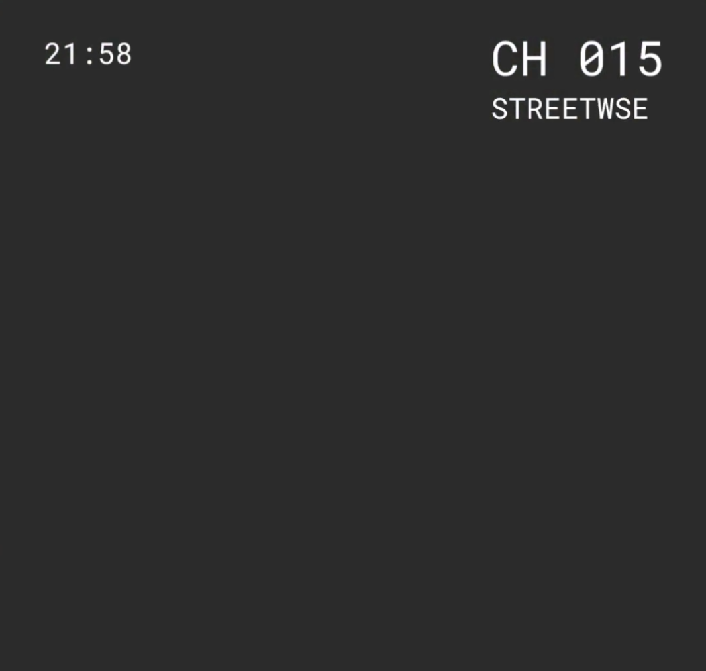
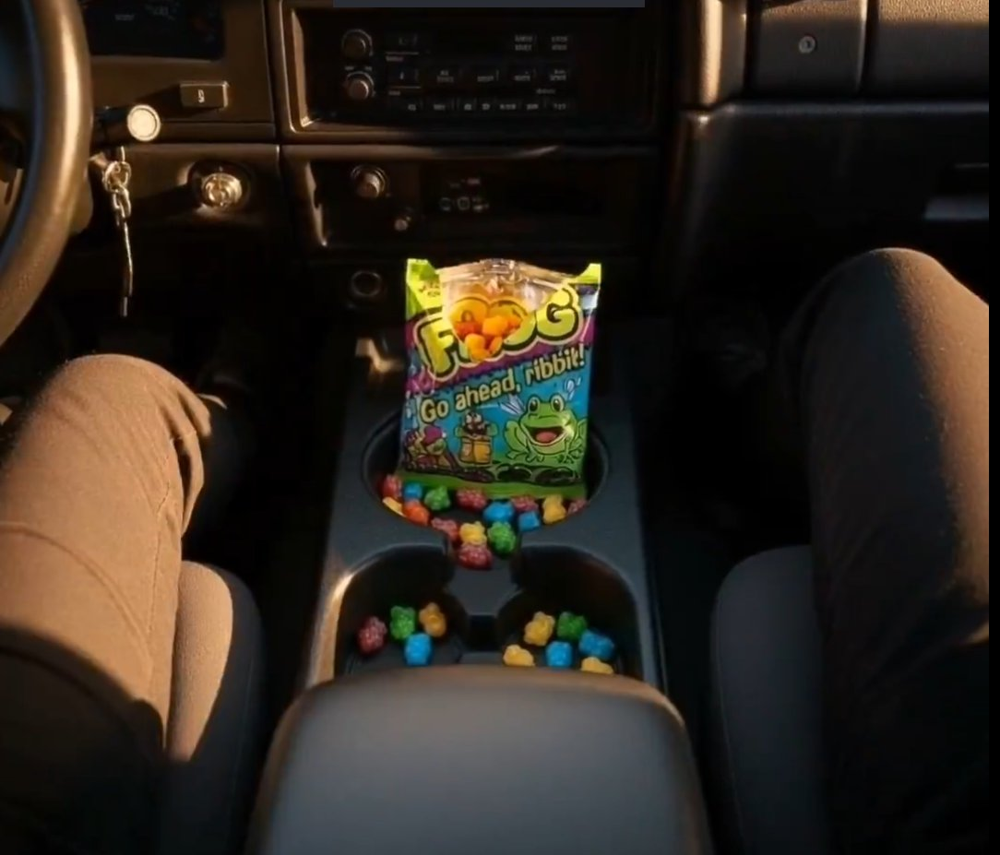

# Neuko.ai TV Portal (Post #9) - First ARG Treasure Hunt Debrief

> **Debrief by [@DendiRedemption](https://x.com/DendiRedemption)**

**Post #9 (Nov 5, 2025):** https://x.com/neukoai/status/1986152753412919577  
**Caption:** https://www.neuko.ai/

---

## The Post

<video controls width="100%"><source src="../../media/videos/posts/post_2025_11_05.mp4" type="video/mp4"></video>

Post #9 is the moment the hunt moved from X into the **website portal**.

---

## Website Portal: PIN → TV Interface

Opening **neuko.ai** revealed a TV with an **Unlock** section and a **6-symbol PIN** prompt.

The PIN was found in [Post 7](./post-7.md).

After entering the correct PIN, the site unlocked a **TV interface** with channels **0–999**.  
Most channels were static, but a small set contained signals.

Credit: A lot of channel discovery was accelerated by **[@afkboom](https://x.com/afkboom)**, who used software to locate the active channels quickly.

Additional discovery credit goes to **[@thrax_nft](https://x.com/thrax_nft)**, who identified a disabled **“Saint Juniper Research Campus”** portal through console and source inspection. Extracted `.txt` files contained G*Boy logs detailing badge protocols, integrity checks, and operational directives, confirming the planned structure of badge distribution.

---

## Active Channels (at the time)

| Channel | Title |
|------:|------|
| 1 | G*BOY |
| 13 | GAMBLIN! |
| 28 | The Crubtub |
| 49 | Real History |
| 55 | No Signal |
| 77 | archives_x_01.vid |
| 86 | archives_x_02.vid |
| 101 | archives_x_03.vid |
| 200 | Rabbits! |
| 203 | archives_x_04.vid |
| 463 | Moths! |
| 550 | archives_x_05.vid |
| 717 | archives_x_06.vid |
| 777 | archives_x_07.vid |

Channels with obvious broadcasts drew attention first (**1, 13, 28, 49, 200, 463**), but the *important* ones were the “quiet” archive channels and Channel 55:

**55, 77, 86, 101, 203, 550, 717, 777**

These could appear empty until you stayed long enough-then they revealed hidden messages.

---

## Channel 55 - Spectrogram Message

Channel 55 contained an audio clue with a spectrogram message:

Decoded message:

> **signals hide where the channels hum.**  
> **the key is underneath the static.**

This was the “you’re close” signpost that pushed people to keep extracting.

---

## The `archives_x` Series (01–07)

The channels below followed a consistent naming pattern: `archives_x_01.vid` → `archives_x_07.vid`.

- 77 - archives_x_01.vid  
- 86 - archives_x_02.vid  
- 101 - archives_x_03.vid  
- 203 - archives_x_04.vid  
- 550 - archives_x_05.vid  
- 717 - archives_x_06.vid  
- 777 - archives_x_07.vid  

<strong>View archives_x frames (optional)</strong>

Each archive video contained one or more messages that functioned like riddles.

---

## Hidden Messages by Channel

### Channel 77 - archives_x_01.vid  
Related post: https://x.com/neukoai/status/1977763395408429229

- “EVERY SCREEN COUNTS”
- “COUNT THE BLINKS OF THE MARK”

### Channel 86 - archives_x_02.vid  
Related post: https://x.com/neukoai/status/1979268208340406384

- “WHEN G304 ENTERS THE FRAME, MARK THE TIME.”

### Channel 101 - archives_x_03.vid  
Related post: https://x.com/neukoai/status/1980355518771392550

- “RECORD THE HOURS GIVEN.”
- “COUNT THE BLOSSOMS TINTED PINK”

### Channel 203 - archives_x_04.vid  
Related post: https://x.com/neukoai/status/1981125805104312473

- “HOW MANY TIMES DOES THE SIREN BREAK THE SILENCE?”

### Channel 550 - archives_x_05.vid  
Related post: https://x.com/neukoai/status/1981740247504269582

- “CHECK THE MONITOR ID. KEEP THE FIRST PAIR OF NUMBERS.”
- “FIND THE EMERGENCY CODE. KEEP ITS FIRST DIGIT ONLY.”

### Channel 717 - archives_x_06.vid  
Related post: https://x.com/neukoai/status/1982894878280569063

- “THE SNAKE STRIKES. RECORD ITS CHANNEL.”
- “THE NUMBER BRIEFLY CARRYING STREETWISE.”

### Channel 777 - archives_x_07.vid  
Related post: https://x.com/neukoai/status/1984362507784351883

- “COUNT THE FROGS THAT FELL.”
- “THE SIGNAL RUNS THROUGH HEMLET. RECORD ITS MODEL.”

---

## Interpreting the Riddles → 12 Numbers

There were **7 archive channels** with messages. The community realized these messages referenced the **NeukoAI X videos released up to that date**.

Each riddle resolved to a **number**. Across the full set, **12 numbers** were obtained-strongly suggesting a **12-word seed phrase**.

Extracted sequence: 9 10 17 7 24 4 12 8 14 15 25 2

---

## Underneath the Static: `key.txt`

By inspecting the website network requests in devtools, a file was found:

https://www.neuko.ai/key.txt

It contained **30 indexed words**:

| # | Word | # | Word | # | Word |
|--:|------|--:|------|--:|------|
| 1 | ember | 11 | moss | 21 | synth |
| 2 | farm | 12 | focus | 22 | delta |
| 3 | static | 13 | gravel | 23 | echo |
| 4 | first | 14 | step | 24 | chicken |
| 5 | pulse | 15 | ready | 25 | square |
| 6 | fracture | 16 | lantern | 26 | coil |
| 7 | apple | 17 | crawl | 27 | fever |
| 8 | wife | 18 | glass | 28 | shrine |
| 9 | record | 19 | tether | 29 | token |
| 10 | deny | 20 | marrow | 30 | hush |

Mapping the 12 numbers to the word list produced the seed phrase:

**record deny crawl apple chicken first focus wife step ready square farm**

---

## The Reward

The seed phrase unlocked the wallet: 71o2Q6oKUbTujnHmKXSSj2VD3EJZ3vUbwGTRN9yei32D

The treasure was **3 Snake Badges**, claimed in a timed race by **[@DendiRedemption](https://x.com/DendiRedemption)**

---

## Extra Note (Channel 717 Message Correction)

During the solve, Channel 717 originally displayed:

> “JPX SPEAK ONCE. NOT ITS CHANNEL.”

This appeared to be an error and was later updated to:

> **“THE SNAKE STRIKES. RECORD ITS CHANNEL.”**

---

## Related Posts

* [Post #7: Channel Flipping](post-7.md) - PIN codes discovered
* [Post #8: Ultimatum](post-8.md) - Previous post
* [Post #10: Claymation](post-10.md) - Next post

## Related Resources

* [Website Documentation](../../website.md) - Complete website details
* [Unsolved Mysteries](../unsolved.md#treasure-trail-completion) - Treasure trail status
* [Puzzle Contributors](/community/overview#thrax_nft) - The solver

[index0]
